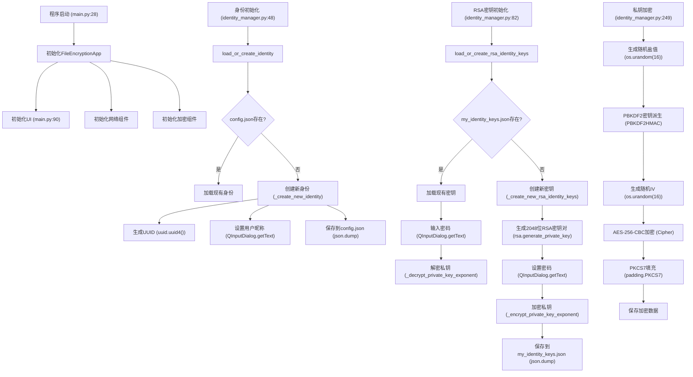
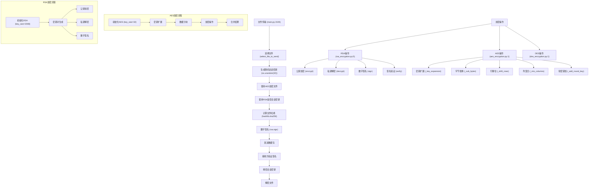
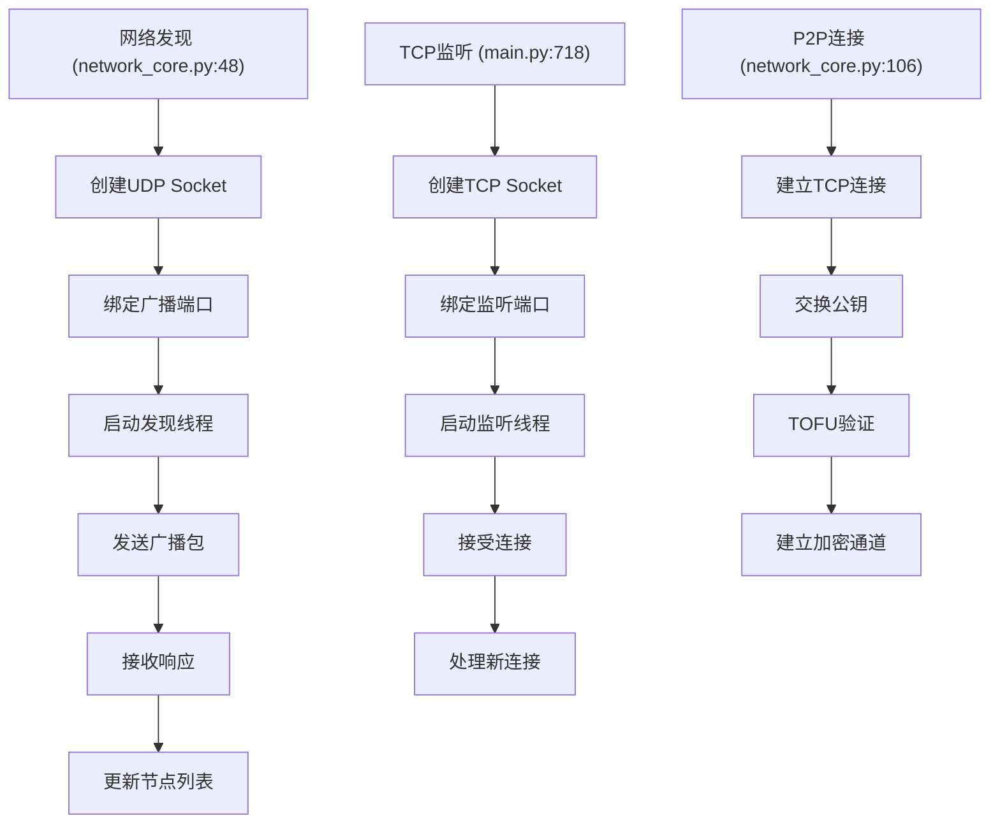
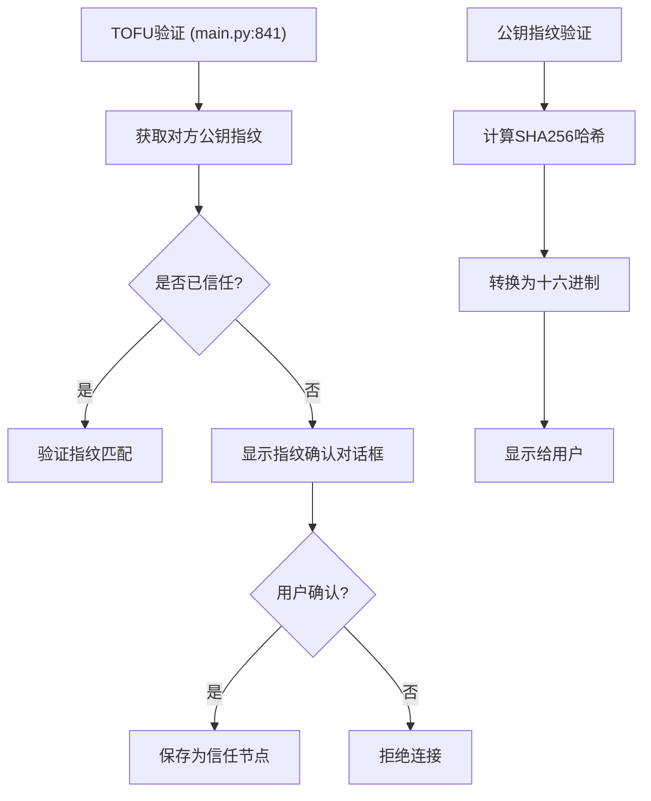
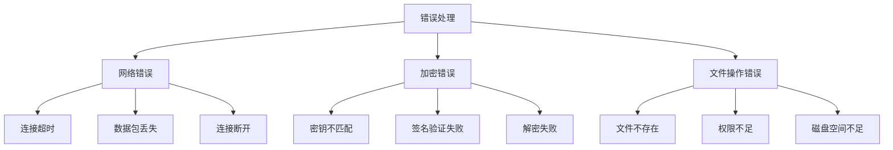

# 文件加密传输系统完整流程图

## 1. 程序初始化和身份管理

## 2. 文件传输和加密操作

## 3. 网络发现和连接管理

## 4. 安全验证流程

## 5. 错误处理流程

## 说明

这些流程图展示了文件加密传输系统的完整架构和流程：

1. **程序初始化和身份管理**：
   - 展示了程序启动、UI初始化、网络和加密组件的初始化过程
   - 详细说明了身份初始化流程，包括UUID生成和用户昵称设置
   - 展示了RSA密钥的创建和管理流程
   - 说明了私钥加密的具体步骤

2. **文件传输和加密操作**：
   - 展示了完整的文件传输流程，从文件选择到最终解密
   - 详细说明了各种加密操作（RSA、AES、DES）的具体实现
   - 包含了AES和RSA加密的详细子流程

3. **网络发现和连接管理**：
   - 展示了UDP发现机制
   - 说明了TCP监听和连接处理流程
   - 详细描述了P2P连接的建立过程

4. **安全验证流程**：
   - 展示了TOFU（Trust On First Use）验证机制
   - 说明了公钥指纹验证过程
   - 包含了用户确认和信任管理

5. **错误处理流程**：
   - 展示了各类错误的处理机制
   - 包括网络、加密和文件操作相关的错误处理
   - 说明了错误恢复和用户通知机制

每个流程图都包含了具体的代码位置和实现细节，便于理解和追踪代码实现。这些流程图共同构成了系统的完整架构视图，有助于理解系统的工作原理和各个组件之间的交互关系。 